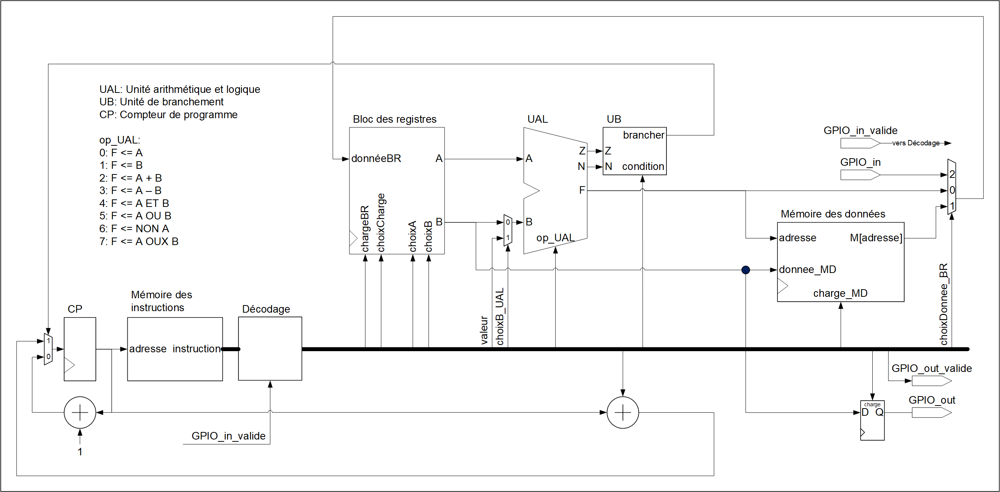

-----------------------------------------------------------------------

<table>
<tr>
<td></td>
<td><h2>
INF3500 - Conception et réalisation de systèmes numériques  
Hiver 2022  
Laboratoire #6 : Processeur à usage général
</h2></td>
</tr>
</table>

------------------------------------------------------------------------

# Implémenter un processeur à usage général sur FPGA

------------------------------------------------------------------------

## Objectifs du laboratoire

À la fin de ce laboratoire, vous devrez être capable de :

- Analyser le chemin des données d’un processeur à usage général afin d’estimer les ressources requises, déterminer les limites opérationnelles du processeur, proposer des changements architecturaux pour implémenter de nouvelles opérations, et donner le code VHDL modifié. (B5)
- Proposer des modifications à l’unité de contrôle et à l’encodage des instructions pour ajouter de nouvelles instructions à un processeur à usage général, et donner le code VHDL modifié. (B5)

Ce laboratoire s'appuie sur le matériel suivant :
1. Les procédures utilisées et les habiletés développées dans les laboratoires #1, #2, #3 et #4.
2. La matière de la semaine 9 (Conception de processeurs à usage général).

### Préparatifs

- Créez un répertoire inf3500\labo5\ dans lequel vous déposerez tous les fichiers de ce laboratoire.
- Importez tous les fichiers du laboratoire à partir de l'entrepôt Git et placez-les dans votre répertoire inf3500\labo5\
- Lancez Active-HD, créez un espace de travail (*workspace*) et créez un projet (*design*). Ajoutez-y tous les fichiers importés. Ou bien lancez et configurez votre environnement de travail préféré.

## Partie 0 : Introduction

Dans cet exercice de laboratoire, on considère l'implémentation d'un processeur à usage général modélisé en VHDL. Des modèles de processeurs ouverts existent et peuvent être analysés, simulés, modifiés, adaptés et implémentés par les utilisateurs dans la technologie de leur choix. Un exemple très populaire présentement est [le modèle de processeur (ou architecture de jeu d'instructions) RISC-V](https://fr.wikipedia.org/wiki/RISC-V). Dans ce laboratoire, on va plutôt utiliser le modèle  du processeur PolyRISC développé expressément pour les besoins du cours INF3500.

### Retour sur le processeur PolyRISC

Le processeur PolyRISC a une architecture à jeu réduit d'instructions (*Reduced Instruction Set Computer* - RISC). Il comporte un chemin des données formé d'un bloc des registres, d'une UAL et d'une mémoire des données. Bien qu'on l'inclut ici, la mémoire des données n'est pas normalement considérée comme faisant partie du processeur. L'unité de contrôle est formée d'un compteur de programme, d'une mémoire des instructions, d'un bloc de décodage et d'une unité de branchement. Les diapositives et vidéos de la semaine #9 donnent tous les détails.

Le processeur PolyRISC inclut un registre d'entrée GPIO_in et un registre de sortie GPIO_out (*General Purpose Input-Output* - GPIO). Ces registres établissent des liens directs entre le monde extérieur et le chemin des données du processeur. Ils sont associés chacun avec un port de contrôle, respectivement GPIO_in_valide et GPIO_out_valide. La fonctionnalité du port de sortie GPI_out est définie dans le code qui vous est donné.

Pour les besoins de cet exercice, nous considérerons le cas où PolyRISC a un chemin des données de 16 bits de large, un bloc avec 16 registres et une mémoire des données de 256 mots. La mémoire des instructions a 256 mots de 32 bits.

Le processeur est décrit dans trois fichiers :
- La description principale : [PolyRISC_v10b.vhd](sources/PolyRISC_v10b.vhd);
- Un package qui définit des constantes et des types : [PolyRISC_utilitaires_pkg.vhd](sources/PolyRISC_utilitaires_pkg.vhd); et,
- Un package dans lequel se trouve un programme à exécuter : [PolyRISC_le_programme_pkg.vhd](sources/PolyRISC_le_programme_pkg.vhd).

Un banc d'essai très rudimentaire [PolyRISC_v10_tb.vhd](sources/PolyRISC_v10_tb.vhd) est fourni pour vérifier le processeur.

### Programme de démonstration : suite de Fibonacci

Considérez le fichier [PolyRISC_le_programme_pkg.vhd](sources/PolyRISC_le_programme_pkg.vhd) qui contient un programme pour le processeur PolyRISC pour calculer le n-ième nombre de la suite de Fibonacci.

Faites la simulation de ce code à l'aide du banc d'essai [PolyRISC_v10_tb.vhd](sources/PolyRISC_v10_tb.vhd). Créez un chronogramme et ajoutez-y tous les signaux de l'UUT. Lancez la simulation pour 800 ns. Observez l’évolution de tous les signaux du processeur PolyRISC dans le chronogramme. Observez en particulier le compteur de programme PC, les différents champs du mot d'instruction, le bit de contrôle N et le contenu du bloc des registres, selon le tableau suivant :
Registre | Contenu
--------- | ------
lesRegistres[0] | compte maximal pour n
lesRegistres[1] | n
lesRegistres[2] | pas utilisé
lesRegistres[3] | nombre de Fibonacci F(n - 1)
lesRegistres[4] | nombre de Fibonacci F(n)
lesRegistres[5] | accumulateur

## Partie 1 : Programmer le PolyRISC - algorithme du plus grand facteur commun (PGFC)

Considérez le pseudo code suivant pour le calcul du plus grand facteur commun entre deux nombres :

    tant que vrai {
        charger X -- Pour la partie 1, faire X ← 100
        sortie ← X
        charger Y -- Pour la partie 1, faire Y ← 60
        sortie ← Y
        tant que X != Y {
            si X > Y {
                X ← X - Y
            } sinon {
                Y ← Y - X
            }
            sortie ← X
            sortie ← Y
        }
        -- on a trouvé le PGFC
        sortie ← X
    }

Écrivez un programme pour le PolyRISC correspondant à cet algorithme. Modifiez le fichier [PolyRISC_le_programme_pkg.vhd](sources/PolyRISC_le_programme_pkg.vhd).

Utilisez le registre R0 pour X et le registre R1 pour Y. Exprimez votre programme avec des opérations sur les registres, puis encodez les opérations selon les spécifications de PolyRISC. Inspirez-vous du fichier de démonstration pour écrire votre code,  Faites la simulation de votre programme pour confirmer qu'il fonctionne correctement.

Simulez l'exécution de votre programme en fixant les valeurs de X et de Y aux constantes 100 et 60, respectivement.

À remettre :
- Votre fichier modifié [PolyRISC_le_programme_pkg.vhd](sources/PolyRISC_le_programme_pkg.vhd). Ne modifiez pas le nom du fichier ni le nom du package.
- Des commentaires dans le fichier [rapport.md](rapport.md) qui expliquent brièvement vos travaux de cette partie.

## Partie 2 : Ajouter l'instruction RC := GPIO_in à PolyRISC

Ajoutez l'instruction RC := GPIO_in au processeur PolyRISC. Quand il exécute cette instruction, le processeur doit s'arrêter complètement (c'est à dire, le CP ne doit pas s'incrémenter) jusqu'à ce que le port GPIO_in_valide prenne la valeur '1'. Le processeur doit alors charger le registre spécifié RC avec la valeur disponible sur le port GPIO_in, puis poursuivre l'exécution de son programme en incrémentant le PC. Par exemple, pour l'instruction R5 := GPIO_in, c'est le registre R5 qui devrait être chargé.

Voici les étapes à suivre :
1. Confirmez la présence d'une constante "lireGPIO_in" de valeur 2 dans le package [PolyRISC_utilitaires_pkg.vhd](sources/PolyRISC_utilitaires_pkg.vhd), dans la section des détails d'instructions pour la catégorie mémoire;
2. Dans le fichier [PolyRISC_v10b.vhd](sources/PolyRISC_v10b.vhd), la modification du code de décodage des instructions pour donner une valeur de 2 au signal choixDonnee_BR quand l'instruction RC := GPIO_in s'exécute.
3. Dans le fichier [PolyRISC_v10b.vhd](sources/PolyRISC_v10b.vhd), la modification du code du multiplexeur pour choisir l'entrée du bloc des registres, afin d'aiguiller le port GPIO_in vers le signal donneeBR quand choixDonnee_BR = 2;
4. Dans le fichier [PolyRISC_v10b.vhd](sources/PolyRISC_v10b.vhd), la modification du code du compteur de programme pour que, lors de l'exécution de l'instruction RC := GPIO_in, le compteur de programme ne s'incrémente que si le port GPIO_in_valide a une valeur de '1';
5. Dans le fichier [PolyRISC_v10b.vhd](sources/PolyRISC_v10b.vhd), la modification du code du signal de contrôle chargeBR pour lui donner une valeur de '1' quand l'instruction RC := GPIO_in s'exécute et que le signal GPIO_in_valide = '1';

L'encodage de cette instruction doit se baser sur les tableaux des diapositives #0904. Plus spécifiquement :
- Il faut utiliser la catégorie 3 (mémoire).
- La section détails (bits 29:26) doit être 2 (0010), soit la valeur de la constante lireGPIO_in que vous avez définie plus haut.
- Les bits 25:21 doivent spécifier le numéro du registre à charger.
- Les autres bits de l'instruction encodée ne sont pas utilisés.

Modifiez votre programme de la partie 1 pour utiliser votre nouvelle instruction, et vérifiez-en le fonctionnement par simulation.

À remettre :
- Vos fichiers modifiés [PolyRISC_v10b.vhd](sources/PolyRISC_v10b.vhd) et [PolyRISC_utilitaires_pkg.vhd](sources/PolyRISC_utilitaires_pkg.vhd). Ne modifiez pas le nom des fichiers, le nom des entités, la liste et le nom des ports, la liste et le nom des `generic`, le nom de l'architecture ni le nom du package.
- Votre programme modifié de la partie 1 dans [PolyRISC_le_programme_pkg.vhd](sources/PolyRISC_le_programme_pkg.vhd). Ne modifiez pas le nom du fichier ni le nom du package. (Remettez un seul programme pour les parties 1, 2 et 3).
- Des commentaires dans le fichier [rapport.md](rapport.md) qui expliquent brièvement vos travaux de cette partie.

## Partie 3 : Implémentation sur la planchette

Implémentez votre programme sur la planchette. Utilisez le fichier [top_labo_5.vhd](sources/top_labo_5.vhd). Observez comment les ports du processeur sont reliés aux ressources de la planchette. L'utilisateur doit spécifier les nombres à entrer à l'aide des commutateurs et du bouton 'Up'. Le bouton du centre sert de reset. Vérifiez le fonctionnement correct de votre processeur modifié.

Le signal de contrôle GPIO_in_valide est relié à un bouton. Comme le processeur fonctionne à une horloge de 100 MHz, il est impossible de peser sur le bouton assez rapidement pour qu'on puisse entrer un nombre à la fois. Une horloge de 1 Hz est donc fournie au processeur. Vous pouvez expérimenter avec différentes fréquences d'horloge.

Utilisez le fichier de commandes [labo_5_synth_impl.tcl](synthese-implementation/labo_5_synth_impl.tcl) et le fichier de contraintes .xdc correspondant à votre planchette. Commentez et décommentez les lignes appropriées du fichier .tcl selon la planchette que vous utilisez.

À remettre :
- Votre fichier de configuration top_labo_5.bit.
- Des commentaires dans le fichier [rapport.md](rapport.md) qui expliquent brièvement vos expériences et observations.

## Partie 4: Ressources pour implémenter le processeur PolyRISC

Mesurez la quantité de ressources nécessaires (Slice LUTs, Slice Registers, F7 Muxes, F8 Muxes, Bonded IOB) pour implémenter le processeur PolyRISC pour les cas suivants.

Nreg | Wd | Mi | Md | version du processeur
---- | -- | -- | -- | ---------------------
16 | 16 | 8 | 8 | version de base fournie avec ce laboratoire
32 | 16 | 8 | 8 | version de base fournie avec ce laboratoire
16 | 32 | 8 | 8 | version de base fournie avec ce laboratoire
32 | 32 | 8 | 8 | version de base fournie avec ce laboratoire
16 | 16 | 8 | 8 | votre version avec les instructions de la partie 2
32 | 16 | 8 | 8 | votre version avec les instructions de la partie 2
16 | 32 | 8 | 8 | votre version avec les instructions de la partie 2
32 | 32 | 8 | 8 | votre version avec les instructions de la partie 2

Avec l'organisation actuelle du code, vous devrez modifier le fichier [PolyRISC_utilitaires_pkg.vhd](sources/PolyRISC_utilitaires_pkg.vhd) pour varier les paramètres Nreg et Wd.

Notez les statistiques dans votre [rapport.md](rapport.md). Commentez complètement vos résultats.

## Remise

La remise se fait directement sur votre entrepôt Git. Poussez régulièrement vos modifications, incluant pour la version finale de vos fichiers avant l'heure et la date limite de la remise. Consultez l'ébauche du fichier [rapport.md](rapport.md) pour la liste des fichiers à remettre.

**Directives spéciales :**
- Ne modifiez pas les noms des fichiers, les noms des entités, les listes des ports, les listes des `generics` ni les noms des architectures.
- Remettez du code de très bonne qualité, lisible et bien aligné, bien commenté. Indiquez clairement la source de tout code que vous réutilisez ou duquel vous vous êtes inspiré/e.
- Modifiez et complétez le fichier [rapport.md](rapport.md) pour donner des détails supplémentaires sur votre code. Spécifiez quelle carte vous utilisez.

## Barème de correction

Le barème de correction est progressif. Il est relativement facile d'obtenir une note de passage (> 10) au laboratoire et il faut mettre du travail pour obtenir l'équivalent d'un A (17/20). Il n'y a pas de bonus pour ce labo.

Critères | Points
--------- | ------
Partie 1 : Code en assembleur de PolyRISC pour le problème du PGFC | 5
Partie 2 : Ajout de l'instruction RC := GPIO_in à PolyRISC et code assembleur modifié | 5
Partie 3 : Implémentation sur la planchette du problème du PGFC | 2
Partie 4 : Ressources | 4
Qualité, lisibilité et élégance du code : alignement, choix des identificateurs, qualité et pertinence des commentaires, respect des consignes de remise incluant les noms des fichiers, orthographe, etc. | 4
**Maximum possible sur 20 points** | **20**

## Références pour creuser plus loin

Les liens suivants ont été vérifiés en septembre 2021.

- Aldec Active-HDL Manual : accessible en faisant F1 dans l'application, et accessible [à partir du site de Aldec](https://www.aldec.com/en/support/resources/documentation/manuals/).
- Tous les manuels de Xilinx :  <https://www.xilinx.com/products/design-tools/vivado/vivado-ml.html#documentation>
- Vivado Design Suite Tcl Command Reference Guide : <https://www.xilinx.com/content/dam/xilinx/support/documentation/sw_manuals/xilinx2021_1/ug835-vivado-tcl-commands.pdf>
- Vivado Design Suite User Guide - Design Flows Overview : <https://www.xilinx.com/support/documentation/sw_manuals/xilinx2020_2/ug892-vivado-design-flows-overview.pdf>
- Vivado Design Suite User Guide - Synthesis : <https://www.xilinx.com/support/documentation/sw_manuals/xilinx2020_2/ug901-vivado-synthesis.pdf>
- Vivado Design Suite User Guide - Implementation : <https://www.xilinx.com/support/documentation/sw_manuals/xilinx2020_2/ug904-vivado-implementation.pdf>
